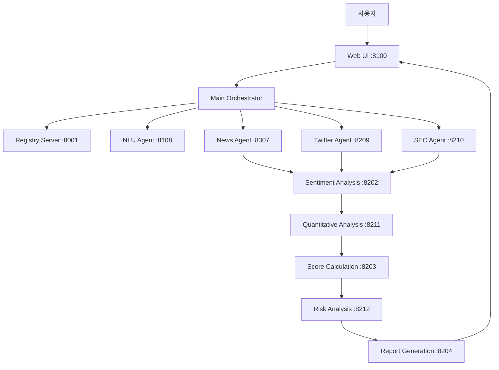

# A2A 기반 AI 투자 분석 시스템 (v3.4)

[](https://www.python.org/downloads/)
[](LICENSE)
[](https://fastapi.tiangolo.com/)
[](https://ai.google.dev/)

> 🤖 **다수의 전문 AI 에이전트가 협력하여 투자 분석을 수행하는 차세대 투자 분석 시스템**

## 📋 프로젝트 소개

A2A (Agent-to-Agent) 프로토콜 기반의 멀티 에이전트 시스템으로, 사용자의 자연어 질문을 이해하고 여러 데이터 소스에서 실시간 정보를 수집하여 전문가 수준의 투자 분석 리포트를 생성합니다.

### 🎯 주요 특징
- **멀티 에이전트 협업**: 9개의 전문 AI 에이전트가 역할별로 협력
- **실시간 데이터 통합**: 뉴스, 소셜미디어, 기업공시 등 다양한 소스
- **가중치 기반 분석**: 데이터 신뢰도에 따른 차등 가중치 적용
- **자연어 인터페이스**: "애플 주가 어때?" 같은 일상 질문 이해
- **전문 리포트 생성**: 증권사 수준의 분석 리포트 자동 생성

## 🚀 빠른 시작

### 1. 저장소 클론
```bash
git clone https://github.com/jeromwolf/A2A_sentiment_analysis.git
cd A2A_sentiment_analysis
```

### 2. Python 환경 설정 (권장)
```bash
# 가상환경 생성
python -m venv venv

# 가상환경 활성화
# Windows
venv\Scripts\activate
# macOS/Linux
source venv/bin/activate
```

### 3. 의존성 설치
```bash
pip install -r requirements.txt
```

### 4. 환경 변수 설정
`.env` 파일을 프로젝트 루트에 생성하고 아래 내용을 추가:

```env
# 필수 API 키
GEMINI_API_KEY=your_gemini_api_key_here
FINNHUB_API_KEY=your_finnhub_api_key_here
TWITTER_BEARER_TOKEN=your_twitter_bearer_token_here
SEC_API_USER_AGENT=YourName your@email.com

# 선택사항
LLM_PROVIDER=gemini  # gemini, gemma3, openai 중 선택
USE_MOCK_DATA=false  # 개발용 더미 데이터 사용 여부
MAX_NEWS_PER_SOURCE=5
```

> 📌 **API 키 발급 방법**
> - **Gemini**: [Google AI Studio](https://aistudio.google.com/app/apikey)
> - **Finnhub**: [Finnhub 가입](https://finnhub.io/register)
> - **Twitter**: [Twitter Developer Portal](https://developer.twitter.com/)

### 5. 시스템 실행
```bash
# 실행 권한 부여 (최초 1회, macOS/Linux)
chmod +x scripts/*.sh

# 전체 시스템 시작
./scripts/start_v2_complete.sh

# 브라우저에서 접속
# http://localhost:8100
```

### 6. 사용 방법
1. 웹 브라우저에서 http://localhost:8100 접속
2. 채팅창에 분석하고 싶은 종목 질문 입력
   - 예: "애플 주가 어때?"
   - 예: "테슬라 투자 심리 분석해줘"
   - 예: "NVDA 리스크 평가해줘"
3. 분석 결과 확인 및 PDF 저장

### 7. 시스템 종료
```bash
./scripts/stop_all.sh
```

## 🔧 트러블슈팅

### 일반적인 문제 해결

#### 포트 충돌 문제
```bash
# 사용 중인 포트 확인
lsof -i :8100

# 프로세스 종료
kill -9 [PID]
```

#### API 키 오류
- `.env` 파일의 API 키가 올바른지 확인
- API 키에 따옴표가 제대로 되어 있는지 확인
- API 사용량 한도 초과 여부 확인

#### 의존성 설치 오류
```bash
# pip 업그레이드
pip install --upgrade pip

# 캐시 삭제 후 재설치
pip cache purge
pip install -r requirements.txt
```

#### 에이전트 실행 실패
```bash
# 개별 에이전트 테스트
python -m uvicorn agents.nlu_agent_v2:app --port 8108 --reload

# 로그 확인
tail -f logs/[agent_name].log
```

## 🏗️ 시스템 아키텍처



## 📊 데이터 소스 및 가중치

| 데이터 소스 | 가중치 | 설명 |
|-----------|-------|------|
| SEC 공시 | 1.5 | 가장 신뢰도 높은 공식 문서 |
| 뉴스 | 1.0 | 전문 언론사의 분석 |
| 트위터 | 0.7 | 실시간 시장 심리 |

## 🧪 개발자 가이드

### 개별 에이전트 테스트
```bash
# NLU 에이전트 실행
uvicorn agents.nlu_agent_v2:app --port 8108 --reload

# API 테스트
curl -X POST http://localhost:8108/extract_ticker \
  -H "Content-Type: application/json" \
  -d '{"query": "애플 주가 어때?"}'
```

### 테스트 실행
```bash
# 전체 테스트
pytest

# 특정 테스트
pytest tests/test_nlu_agent_v2.py

# 커버리지 포함
pytest --cov=agents --cov-report=html
```

### 로그 디버깅
```bash
# 실시간 로그 확인
tail -f logs/orchestrator.log

# 특정 에이전트 로그
tail -f logs/sentiment_analysis.log
```

## 📈 버전 히스토리

### v3.4 (2025-07-20)
- A2A 프로토콜 설계 원칙 문서화
- 40개 이상의 프레젠테이션 자료 추가
- 시스템 안정성 향상

### v3.3 (2025-07-18)
- MCP (Model Context Protocol) 통합
- 하이브리드 아키텍처 구현

[전체 버전 히스토리 보기](#버전-히스토리)

## 🤝 기여하기

1. Fork the Project
2. Create your Feature Branch (`git checkout -b feature/AmazingFeature`)
3. Commit your Changes (`git commit -m 'Add some AmazingFeature'`)
4. Push to the Branch (`git push origin feature/AmazingFeature`)
5. Open a Pull Request

## 📝 라이선스

MIT 라이선스 - 자세한 내용은 [LICENSE](LICENSE) 파일 참조

## 🙏 감사의 말

- Google Gemini AI팀
- Finnhub, Twitter, SEC API 제공팀
- FastAPI 개발팀
- 모든 기여자들

---

**💬 문의사항**: [Issues](https://github.com/jeromwolf/A2A_sentiment_analysis/issues) | **📧 이메일**: your@email.com