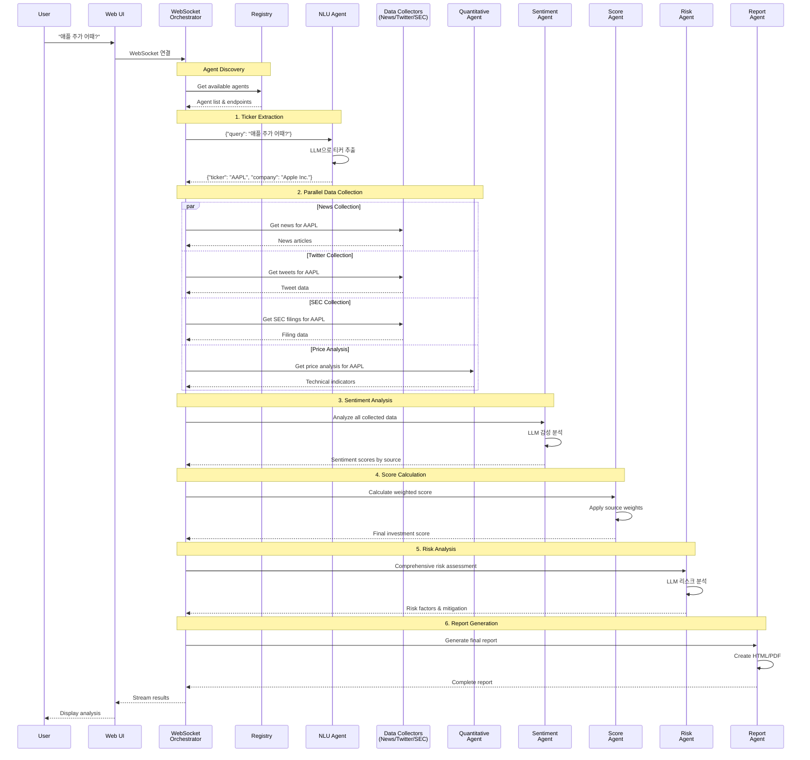

# A2A 감성 분석 시스템 아키텍처 구조도

## 시스템 전체 구조도

```mermaid
graph TB
    subgraph "Client Layer"
        UI[Web UI<br/>http://localhost:8100]
    end
    
    subgraph "A2A Protocol Layer"
        WS[WebSocket Server<br/>Main Orchestrator V2<br/>:8100]
        REG[Registry Server<br/>:8001]
    end
    
    subgraph "Agent Layer - Data Collection"
        NLU[NLU Agent<br/>:8108<br/>티커 추출]
        NEWS[News Agent<br/>:8307<br/>Finnhub API]
        TWITTER[Twitter Agent<br/>:8209<br/>Twitter API v2]
        SEC[SEC Agent<br/>:8210<br/>SEC EDGAR]
    end
    
    subgraph "Agent Layer - Analysis"
        SENT[Sentiment Analysis Agent<br/>:8202<br/>Gemini/OpenAI/Ollama]
        QUANT[Quantitative Analysis Agent<br/>:8211<br/>yfinance/TA-Lib]
        SCORE[Score Calculation Agent<br/>:8203<br/>가중치 계산]
        RISK[Risk Analysis Agent<br/>:8212<br/>종합 리스크 평가]
    end
    
    subgraph "Agent Layer - Output"
        REPORT[Report Generation Agent<br/>:8204<br/>HTML/PDF 생성]
    end
    
    subgraph "External APIs"
        GEMINI[Google Gemini API]
        OPENAI[OpenAI API]
        FINNHUB[Finnhub API]
        TWITTER_API[Twitter API]
        SEC_API[SEC EDGAR API]
        YFINANCE[Yahoo Finance]
    end
    
    subgraph "Optional Services"
        REDIS[Redis Cache<br/>:6379]
    end
    
    %% Client to Orchestrator
    UI -.->|WebSocket| WS
    
    %% Registry connections
    WS -.->|Agent Discovery| REG
    NLU -.->|Register| REG
    NEWS -.->|Register| REG
    TWITTER -.->|Register| REG
    SEC -.->|Register| REG
    SENT -.->|Register| REG
    QUANT -.->|Register| REG
    SCORE -.->|Register| REG
    RISK -.->|Register| REG
    REPORT -.->|Register| REG
    
    %% Orchestration Flow
    WS -->|1. Extract Ticker| NLU
    NLU -->|Ticker Symbol| WS
    
    WS -->|2. Parallel Requests| NEWS
    WS -->|2. Parallel Requests| TWITTER
    WS -->|2. Parallel Requests| SEC
    WS -->|2. Parallel Requests| QUANT
    
    NEWS -->|News Data| WS
    TWITTER -->|Tweet Data| WS
    SEC -->|Filing Data| WS
    QUANT -->|Price Data| WS
    
    WS -->|3. Analyze Sentiment| SENT
    SENT -->|Sentiment Scores| WS
    
    WS -->|4. Calculate Score| SCORE
    SCORE -->|Weighted Score| WS
    
    WS -->|5. Analyze Risk| RISK
    RISK -->|Risk Assessment| WS
    
    WS -->|6. Generate Report| REPORT
    REPORT -->|Final Report| WS
    
    %% External API connections
    NLU -.->|LLM Query| GEMINI
    NEWS -.->|News Query| FINNHUB
    TWITTER -.->|Tweet Query| TWITTER_API
    SEC -.->|Filing Query| SEC_API
    SENT -.->|LLM Analysis| GEMINI
    SENT -.->|LLM Analysis| OPENAI
    QUANT -.->|Stock Data| YFINANCE
    RISK -.->|LLM Analysis| GEMINI
    REPORT -.->|LLM Generation| GEMINI
    
    %% Cache connections
    NLU -.->|Cache| REDIS
    NEWS -.->|Cache| REDIS
    TWITTER -.->|Cache| REDIS
    SEC -.->|Cache| REDIS
    SENT -.->|Cache| REDIS
    
    classDef client fill:#e1f5fe,stroke:#01579b,stroke-width:2px
    classDef orchestrator fill:#f3e5f5,stroke:#4a148c,stroke-width:2px
    classDef collector fill:#fff3e0,stroke:#e65100,stroke-width:2px
    classDef analyzer fill:#e8f5e9,stroke:#1b5e20,stroke-width:2px
    classDef output fill:#fce4ec,stroke:#880e4f,stroke-width:2px
    classDef external fill:#f5f5f5,stroke:#424242,stroke-width:1px,stroke-dasharray: 5 5
    classDef optional fill:#efebe9,stroke:#3e2723,stroke-width:1px,stroke-dasharray: 5 5
    
    class UI client
    class WS,REG orchestrator
    class NLU,NEWS,TWITTER,SEC collector
    class SENT,QUANT,SCORE,RISK analyzer
    class REPORT output
    class GEMINI,OPENAI,FINNHUB,TWITTER_API,SEC_API,YFINANCE external
    class REDIS optional
```



## 데이터 흐름도 (Sequence Diagram)



## 에이전트 상세 정보

### 1. **Registry Server (포트 8001)**
- **역할**: 에이전트 등록 및 발견 서비스
- **기능**: 
  - 에이전트 등록/해제
  - 에이전트 상태 확인
  - 엔드포인트 정보 제공

### 2. **Main Orchestrator V2 (포트 8100)**
- **역할**: 전체 워크플로우 조정
- **기능**:
  - WebSocket 서버 운영
  - A2A 프로토콜 메시지 라우팅
  - 에이전트 간 통신 조정
  - UI 실시간 업데이트

### 3. **NLU Agent (포트 8108)**
- **역할**: 자연어 이해 및 티커 추출
- **API**: POST /extract_ticker
- **LLM**: Gemini AI

### 4. **Data Collection Agents**
- **News Agent (포트 8307)**: Finnhub API 뉴스 수집
- **Twitter Agent (포트 8209)**: Twitter API v2 소셜 데이터
- **SEC Agent (포트 8210)**: SEC EDGAR 공시 자료

### 5. **Analysis Agents**
- **Sentiment Analysis (포트 8202)**: 다중 LLM 감성 분석
- **Quantitative Analysis (포트 8211)**: 기술적 지표 계산
- **Score Calculation (포트 8203)**: 가중치 기반 점수 산출
- **Risk Analysis (포트 8212)**: 종합 리스크 평가

### 6. **Report Generation Agent (포트 8204)**
- **역할**: 최종 보고서 생성
- **출력**: HTML/PDF 형식

## 가중치 시스템

```
데이터 소스별 신뢰도 가중치:
- SEC 공시: 1.5 (가장 신뢰도 높음)
- 뉴스: 1.0 (기준값)
- 트위터: 0.7 (신뢰도 낮음)
```

## 통신 프로토콜

### A2A 메시지 구조
```json
{
    "protocol": "a2a",
    "version": "1.0",
    "sender": "orchestrator",
    "recipient": "nlu_agent",
    "message_id": "uuid",
    "timestamp": "2024-01-01T00:00:00Z",
    "performative": "request",
    "body": {
        "action": "extract_ticker",
        "query": "애플 주가 어때?"
    }
}
```

### WebSocket 메시지 타입
- `status_update`: 처리 상태 업데이트
- `agent_result`: 에이전트 실행 결과
- `error`: 오류 발생
- `complete`: 분석 완료
- `chart_update`: 차트 데이터 업데이트 (계획)

## 보안 및 인증

- **API Key 인증**: 모든 에이전트 요청에 X-API-Key 헤더 필요
- **환경 변수**: 외부 API 키는 .env 파일에 저장
- **Redis 캐싱**: 선택적 캐싱으로 성능 향상 (현재 비활성화)