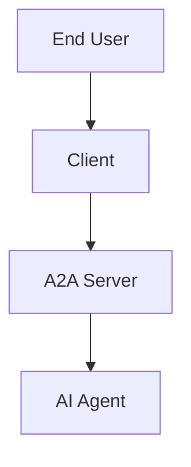

# A2A 다이어그램 생성 가이드

## 깨지는 다이어그램 목록

### 1. A2A Communication Elements
- 위치: a2a_deep_dive_1.md 
- 내용: Part, Agent Card, Message, Task, Artifact 관계도

### 2. A2A Core Actors  
- 위치: a2a_deep_dive_1.md
- 내용: End-User, Client, A2A Server, AI Agent 구조

### 3. A2A Discovery Methods
- 위치: a2a_deep_dive_1.md 
- 내용: Well-Known URI, Curated Registry, Direct Config

### 4. N×M vs 1×N Architecture
- 위치: a2a_protocol_benefits.md
- 내용: 직접 API 통합 vs A2A 표준 통신 비교

### 5. Ambient Signals
- 위치: a2a_protocol_benefits.md
- 내용: 이벤트 기반 에이전트 활성화

## 추천 도구

### 1. Excalidraw (권장)
- URL: https://excalidraw.com/
- 장점: 손그림 스타일, 직관적
- 내보내기: PNG, SVG

### 2. draw.io
- URL: https://app.diagrams.net/
- 장점: 전문적인 다이어그램
- 템플릿 많음

### 3. Mermaid (간단한 구조)


## 이미지 저장 위치
```
/presentation/marp_slides/images/
├── a2a_communication_elements.png
├── a2a_core_actors.png
├── a2a_discovery_methods.png
├── api_integration_comparison.png
└── ambient_signals.png
```

## 슬라이드에서 사용
```markdown

```

## 스타일 가이드
- 배경: 흰색 또는 밝은 회색
- 주요 색상:
  - 파란색 (#007AFF): 주요 구성요소
  - 주황색 (#FF9500): 보조 요소
  - 보라색 (#5856D6): 특수 기능
- 폰트: Sans-serif
- 박스: 둥근 모서리 (8px)