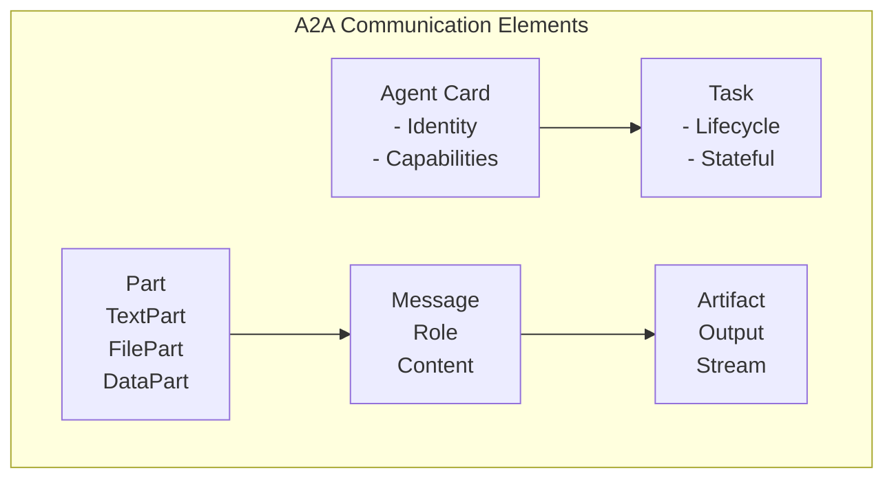

# Marp에서 ASCII 다이어그램 깨짐 해결 방법

## 문제 원인
- Marp의 기본 폰트가 ASCII 박스 문자를 제대로 렌더링하지 못함
- 고정폭 폰트가 아닌 경우 정렬이 틀어짐

## 해결 방법

### 1. 이미지로 변환 (권장)
```markdown

```

### 2. Mermaid 다이어그램 사용


### 3. HTML/SVG 사용
```html
<div style="border: 2px solid #333; padding: 20px; font-family: monospace;">
  <h4>A2A Architecture</h4>
  <!-- 내용 -->
</div>
```

### 4. 스타일에 고정폭 폰트 추가
```yaml
style: |
  pre, code {
    font-family: 'Consolas', 'Monaco', 'Courier New', monospace;
    font-size: 16px;
    line-height: 1.2;
  }
```

## 추천 워크플로우

1. **중요한 다이어그램**: draw.io나 Excalidraw로 그려서 PNG로 저장
2. **간단한 구조**: Mermaid 사용
3. **코드 블록**: 백틱 3개로 감싸기

## 도구
- **draw.io**: https://app.diagrams.net/
- **Excalidraw**: https://excalidraw.com/
- **Mermaid Live**: https://mermaid.live/