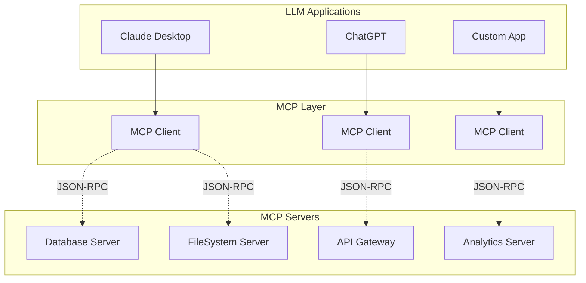
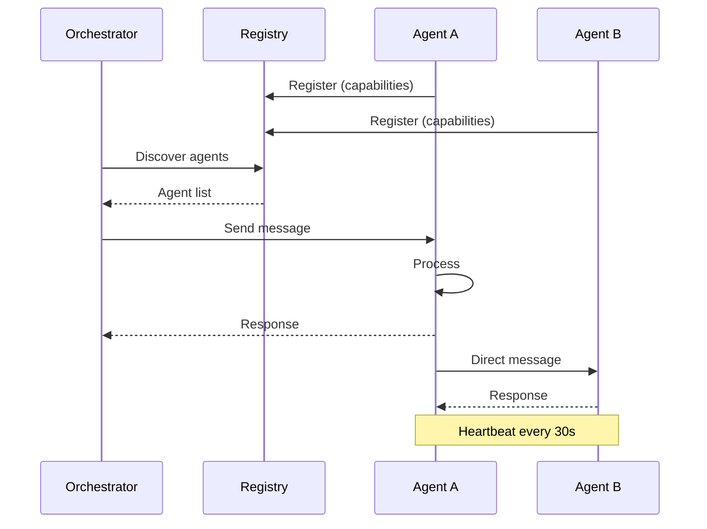

# 프로토콜 다이어그램 생성 가이드

## MCP 아키텍처 다이어그램


## A2A 통신 플로우


## 이미지 활용 방법

### 1. Mermaid 다이어그램 → 이미지 변환
- https://mermaid.live/ 에서 렌더링
- SVG/PNG로 다운로드
- `images/` 폴더에 저장

### 2. Draw.io 활용
- https://app.diagrams.net/
- 아키텍처 다이어그램 작성
- PNG 내보내기

### 3. 슬라이드에 삽입
```markdown


```

## 추천 다이어그램
1. **MCP 전체 아키텍처**: 클라이언트-서버 구조
2. **A2A 메시지 플로우**: 시퀀스 다이어그램
3. **하이브리드 시스템**: MCP + A2A 통합 구조
4. **성능 비교**: 병렬 vs 순차 처리
5. **에러 처리 플로우**: Fallback 메커니즘